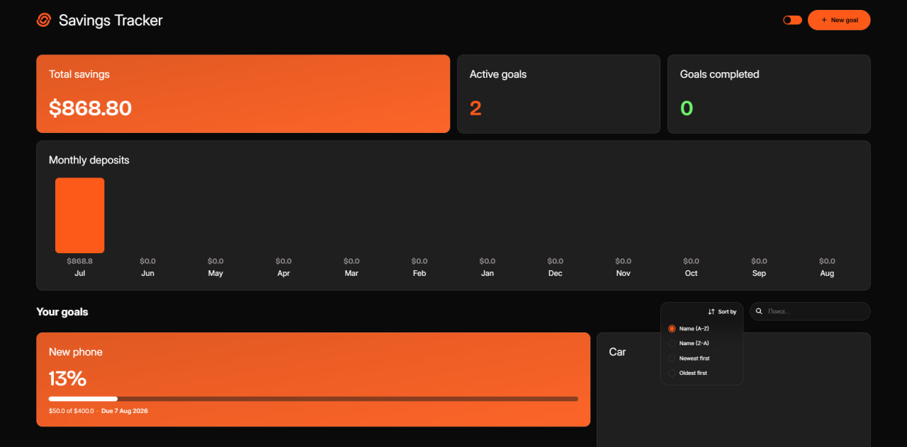
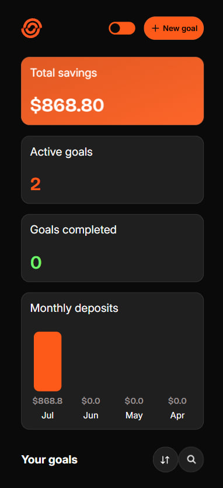
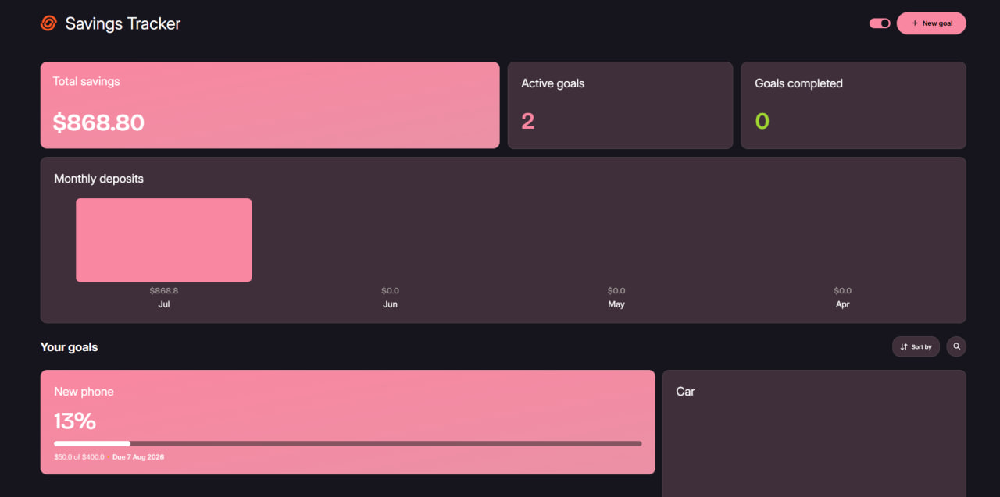

# Savings Tracker

A fully functional savings tracker built with vanilla JavaScript.
Design&idea inspired by the [Frontend Mentor Savings Tracker challenge](https://www.frontendmentor.io/challenges/savings-tracker)

[Live Demo](https://slnt66.github.io/Savings-tracker-app/)

## Preview
### Desktop

### Mobile

### Theme switch

## Technologies
- HTML5
- CSS3
- JavaScript (ES6+)

## Used concepts
- Classes
- ES modules
- LocalStorage API
- DOM manipulation
- Event delegation
- Responsive layouts
- CSS animations

## Features
- Create and delete savings goals
- Track progress for each goal
- Add deposits and calculate completion percentage
- Sort goals by name and creation date
- Search through existing goals
- Monthly deposit statistics visualization
- Dark/custom theme switching
- Responsive design for desktop and mobile
- Data persistence using localStorage

## Future Ideas
- Full CRUD support: currently goal editing is not implemented
- Goal's archive: to keep completed goals and statistics
- Login system(needs backend) to become web-application